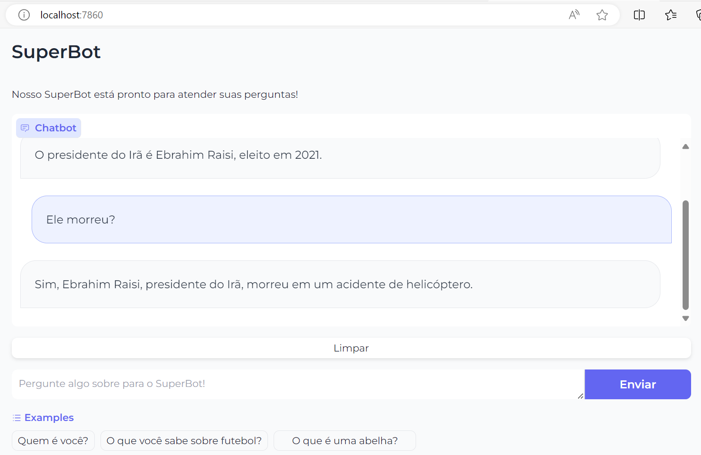
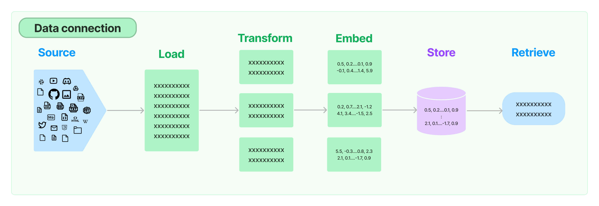

# LLM4Devs - RAG (Retrieval Augmented Generation)

Este projeto foi realizado no Bootcamp LLM4Devs, conduzido pelo [Gustavo Pinto](https://gustavopinto.org/), da [ML4SE](https://ml4se.substack.com/).

Foi desenvolvido um chat para responder questões sobre uma base de dados própria. No caso, utilizei uma página da web com uma [notícia específica](https://g1.globo.com/mundo/noticia/2024/05/20/ebrahim-raisi-presidente-do-ira-morre-em-queda-de-helicoptero-diz-tv-estatal.ghtml).



No trabalho empregou-se a técnica de Retrieval Augmented Generation (RAG) na construção da solução, utilizando-se de recursos como APIs da OpenAI para vetorização (embeddings) e geração de texto (chat), banco de dados PostgreSQL e framework [LangChain](https://python.langchain.com/v0.1/docs/modules/data_connection/). Foram desenvolvidas as seguintes etapas:



## Ferramentas

Foi utilizado Python como linguagem de programação e o Postgres como banco de dados:

- Python: 3.10 ou superior
- Ambiente virtual: Para não criar confusão com as bibliotecas do sistema e as utilizadas no bootcamp, foi criado um ambiente virtual separado e instaladas as dependencias do Python.
- PostgreSQL: 15 ou superior
Foi utilizada também a extensão pgvector do Postgres. O [PGVector](https://github.com/pgvector/pgvector) é uma ferramenta muito importante para criação de aplicações baseadas em LLMs, uma vez que ele fornece novos tipos de armazenamento e busca de dados.
- Base de dados no postgres: Foi criada uma base de dados e uma tabela usando o `VECTOR`. Primeiro, foi realizada a conexão via linha de comando no banco de dados:

```bash
$ psql -h 127.0.0.1 -U postgres
```

Uma vez conectado, foi executado o script abaixo para criar a base e a tabela.

```sql 
CREATE DATABASE bootcamp_llm;

\c bootcamp_llm

CREATE EXTENSION IF NOT EXISTS vector;

DROP TABLE IF EXISTS embeddings;

CREATE TABLE IF NOT EXISTS embeddings (
    id SERIAL PRIMARY KEY,
    content TEXT,
    chars INTEGER,
    embeddings VECTOR
);
```

## Acesso a OpenAI

PAra ter acesso às APIs da OpenAI, foi preciso criar uma chave própria para acessar a [plataforma da OpenAI](https://platform.openai.com/). 

A chave obtida foi adicionada à variavel de ambiente `OPENAI_API_KEY` dentro do arquivo `.env`.

```
OPENAI_API_KEY = "<CHAVE>"
```

## Interface web

Por fim, para executar a aplicação localmente, basta rodar o seguinte comando:

- `python3 $PATH/bootcamp-llm4devs/core/main.py`

